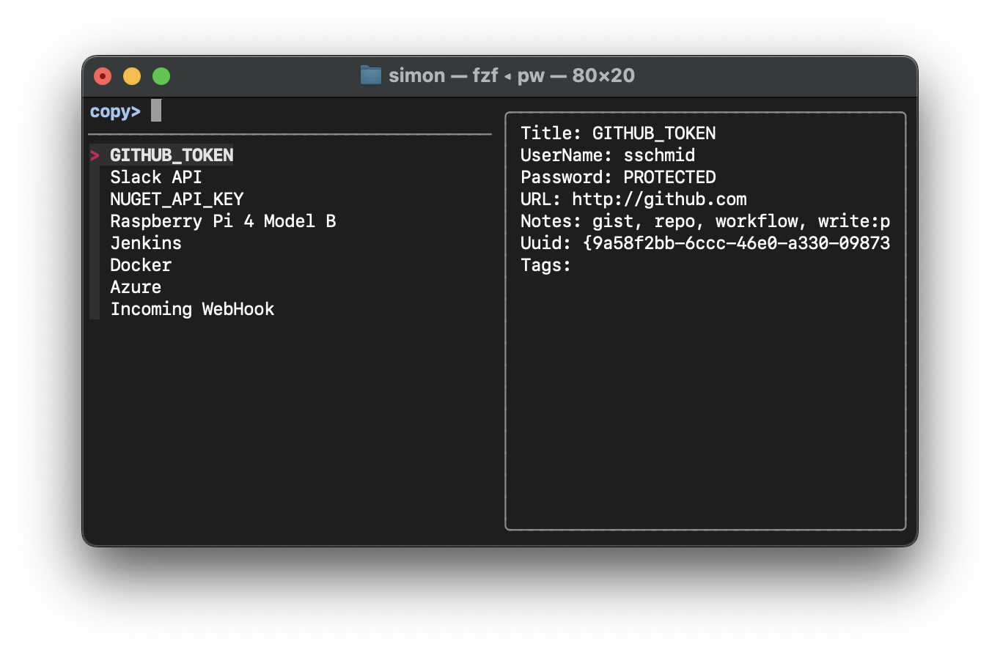
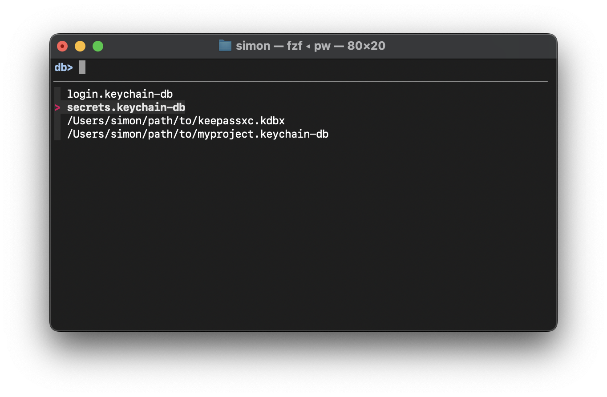

# 🔐 `pw` - Terminal Password Manager powered by `fzf`

`pw` is a command-line password manager unifying trusted password managers
like [macOS Keychain](https://developer.apple.com/documentation/security/keychain_services),
[KeePassXC](https://keepassxc.org) and [GnuPG](https://www.gnupg.org) in a single interface within the terminal.
It combines the security of your favourite password managers with the speed and
simplicity of the [fzf](https://github.com/junegunn/fzf) fuzzy finder and allows
you to interact with [various keychains](#example-using-multiple-keychains) effortlessly.

[](https://github.com/sschmid/pw-terminal-password-manager/actions/workflows/ci.yaml)
[](https://coveralls.io/github/sschmid/pw-terminal-password-manager)
[](https://github.com/sschmid/pw-terminal-password-manager/releases)
[](https://twitter.com/intent/follow?original_referer=https%3A%2F%2Fgithub.com%2Fsschmid%2Fpw&screen_name=s_schmid&tw_p=followbutton)

# Why `pw`?

- **Unified Interface:** `pw` unifies trusted password managers in a single terminal interface.
- **Efficiency:** With the [fzf](https://github.com/junegunn/fzf) fuzzy finder, `pw` allows for rapid and intuitive interaction with your keychains - nice!
- **Simplicity:** `pw` is built using simple bash, making it easy to understand, modify, and extend.
- **Extensibility:** Adding plugins for your preferred password managers takes only minutes (see [plugins](src/plugins)).
- **Clipboard Management:** Automatically clears passwords from the clipboard after a specified duration.
- **Multiple Keychain Support**: Effortlessly manage and switch between [multiple keychains](#example-using-multiple-keychains) stored in various locations.



# Install and update `pw`

```bash
# install
bash -c "$(curl -fsSL https://raw.githubusercontent.com/sschmid/pw-terminal-password-manager/main/install)"
brew install fzf

# update
pw update
brew upgrade fzf

# uninstall
/usr/local/opt/pw/install --uninstall
brew uninstall fzf
```

# How `pw` works

`pw` provides a unified interface to interact with various keychains and
forwards commands to the respective password manager using plugins.
Plugins are simple bash scripts that implement the following functions (see [plugins](src/plugins)):

- `init`
- `add`
- `edit`
- `get`
- `show`
- `rm`
- `ls`
- `open`
- `lock`
- `unlock`

Password managers may vary in their capabilities, so `pw` provides a
consistent interface by implementing workarounds where necessary.

Here's an overview of which features are supported by each plugin:

Legend:
- ✅: native support by the password manager
- 🤩: workaround implemented by `pw`
- ❌: not supported by the password manager

| Feature                                                                         | macOS Keychain | KeePassXC                           | GnuPG          |
|--------------------------------------------------------------------------------:|:--------------:|:-----------------------------------:|:--------------:|
| Create keychain                                                                 | ✅             | ✅                                   | ✅ (directory) |
| Add entry with name and password                                                | ✅             | ✅                                   | ✅             |
| Add entry with name, account, url, notes and password                           | ✅             | ✅                                   | 🤩             |
| Allow multiple entries with the same <br /> name given the account is different | ✅             | ❌                                   | ❌             |
| Add entry in groups (e.g. Coding/GitHub)                                        | ❌             | 🤩                                   | ✅             |
| Edit entry                                                                      | ✅             | ✅                                   | ✅             |
| Remove entry                                                                    | ✅             | ✅                                   | ✅             |
| List entries                                                                    | ✅             | ✅                                   | ✅             |
| Open keychain                                                                   | ✅             | ✅                                   | ✅             |
| Lock keychain                                                                   | ✅             | ❌ (keychain is never left unlocked) | ✅             |
| Unlock keychain                                                                 | ✅             | ✅ (starts interactive session)      | ✅             |
| Key file support                                                                | ❌             | ✅                                   | ❌             |
| YubiKey support                                                                 | ❌             | ✅                                   | ❌             |
| Automatic keychain discovery                                                    | ✅             | ✅                                   | ✅             |

# Quickstart

```bash
# create a keychain
pw init ~/secrets.keychain-db

# optionally configure keychains in ~/.pwrc so you can access them from anywhere
# otherwise, pw will discover keychains in the current directory
echo 'PW_KEYCHAINS=(~/secrets.keychain-db)' > ~/.pwrc

# add an entry
pw add GitHub sschmid

# add another entry interactively
pw add

# copy the password directly by providing the name
pw GitHub

# or use fzf to select an entry (-p prints the password instead of copying it)
pw -p
```

# Usage

In all following examples, `[<args>]` refers to the optional
arguments `name`, `account`, `url`, `notes` in that order.

When using fzf mode to select an entry, such as when getting, editing,
or removing an entry, you can toggle the entry preview by pressing `?`.
The entry preview shows details like the name, account, url, and notes and
is off by default.

Press `CTRL-Y` on any entry to copy (or print) the details.

## Create keychain

```
pw init <keychain>                 create keychain
```

```bash
pw init ~/secrets.keychain-db
pw init ~/secrets.kdbx
pw init ~/secrets/              # end with `/` to create a directory for GnuPG

# macos_keychain special behaviour
pw init secrets.keychain-db            # will create a keychain in ~/Library/Keychains
pw init "${PWD}/secrets.keychain-db"   # will create a keychain in the current directory
```

## Add entry with name and optional account

```
pw add [<args>]                    add entry. If no args, interactive mode
```

```bash
pw add                               # add interactively
pw add GitHub
pw add Google work@example.com
pw add Google personal@example.com
pw add Homepage admin https://example.com
pw add Coveralls "" https://coveralls.io "login via GitHub"
```

If a plugin doesn't support multiple entries with the same name,
you can add the account to the name:

```bash
pw add "Google (Work)" work@example.com
pw add "Google (Personal)" personal@example.com
```

## Add entry in group

```bash
pw add Coding/GitHub
pw add Coding/JetBrains
```

## Edit entry

```
pw edit [<args>]                   edit entry. If no args, fzf mode
```

```bash
pw edit          # starts fzf to select an entry
pw edit GitHub
```

## Get entry

```
pw [-p] [<args>]                   copy (or print) password. If no args, fzf mode
```

```bash
pw          # starts fzf to select an entry
pw GitHub
```

## Show entry

```
pw show [-p] [<args>]              copy (or print) details. If no args, fzf mode
```

```bash
pw show          # starts fzf to select an entry
pw show GitHub
```

## Remove entry

```
pw rm [<args>]                remove entry. If no args, fzf mode
```

```bash
pw rm          # starts fzf to select an entry
pw rm GitHub
```

## Generate a password

```
pw gen [-p] [<length>] [<class>]   generate password with given length and
                                   character class (default: 35 [:graph:])
```

```bash
pw gen                  # equivalent to pw gen 35 '[:graph:]'
pw gen 16
pw gen 24 '[:alnum:]'
pw gen 32 '[:digit:]'
```

## Specifying a keychain

There are multiple ways to specify a keychain:

```bash
# specify keychain using -k for the current command (overrides PW_KEYCHAIN)
pw -k secrets.keychain-db
```

```bash
# specify keychain for the current command
PW_KEYCHAIN=secrets.keychain-db pw
```

```bash
# export default keychain for the current shell
export PW_KEYCHAIN=secrets.keychain-db
pw
```

```
pw init secrets.keychain-db
pw -k secrets.keychain-db add GitHub sschmid
Enter password for github:

pw -k secrets.keychain-db -p
╭──────────────────────────────────────────────────────────────────────────────╮
│ >                                                                            │
│ > GitHub                  sschmid                 secrets.keychain-db        │
│                                                                              │
│                                                                              │
│                                                                              │
╰──────────────────────────────────────────────────────────────────────────────╯
```

## Using multiple keychains

`pw` allows you to interact with multiple keychains from different password
managers. This feature is particularly useful when you have keychains stored
in various locations. You can specify different keychains using the `PW_RC`
configuration file, which defaults to `~/.pwrc`.

By default, `pw` uses the keychain specified in the `PW_KEYCHAIN` variable.
However, you can define multiple keychains in the `PW_KEYCHAINS` array
within the `~/.pwrc` configuration file. Here's an example of how the
default `~/.pwrc` file looks:

```bash
PW_KEYCHAINS=()
```

To use multiple keychains, modify the `PW_KEYCHAINS` array to include
the paths to your desired keychains, e.g.:

```bash
PW_KEYCHAINS=(
  secrets.keychain-db
  ~/path/to/myproject.keychain-db
  ~/path/to/keepassxc.kdbx
  ~/path/to/gpg/secrets
)
```

After configuring your keychains, continue using `pw` as usual. If no keychain
is specified with `-k` or by setting `PW_KEYCHAIN`, `pw` allows you to select
one from `PW_KEYCHAINS` using the fuzzy finder.



## Automatic keychain discovery

Plugins that support automatic keychain discovery will automatically search
for keychains in the current directory and add them to the `PW_KEYCHAINS` array.
This way you can keep your keychains in the same directory as your project
and `pw` will automatically discover and use them.

## Using `pw` in a command or script
Use `pw` to avoid leaking secrets in scripts that you share or commit.

```bash
curl -s -H "Authorization: token $(pw -p GITHUB_TOKEN)" https://api.github.com/user
```

## Provide passwords via `STDIN`

To avoid password prompts that can interrupt scripts,
you can provide passwords via `STDIN`.

> ⚠️ Warning: Avoid providing passwords in plain text, because they can be
  exposed in process listings, shell history, logs, and through insecure network
  transmissions, making them vulnerable to theft or misuse. Instead, use secure
  methods like environment variables to protect sensitive information.

```bash
echo "${MY_PASSWORD}" | pw init ~/secrets.kdbx
echo "${MY_PASSWORD}" | pw add Google personal@example.com
echo "${MY_PASSWORD}" | pw unlock
```

If your shell supports `STDIN` with here string (like `bash`), you can use it like this:

```bash
pw init ~/secrets.kdbx <<< "${MY_PASSWORD}"
pw add Google personal@example.com <<< "${MY_PASSWORD}"
pw unlock <<< "${MY_PASSWORD}"
```

# Customization

Export or provide the following variables to customize and change `pw`'s default behaviour:

```bash
# Default keychain used when not specified with -k
# otherwise, PW_KEYCHAINS is used to select a keychain with fzf
export PW_KEYCHAIN=secrets.keychain-db

# Default length of generated passwords
export PW_GEN_LENGTH=35

# Default character class for generated passwords
export PW_GEN_CLASS='[:graph:]'

# Time after which the password is cleared from the clipboard
export PW_CLIP_TIME=45

# Path to the configuration file
export PW_RC=~/.mypwrc
```

Configure keychains in `~/.pwrc`

```bash
PW_KEYCHAINS=(
  secrets.keychain-db
  ~/path/to/myproject.keychain-db
  ~/path/to/keepassxc.kdbx
  ~/path/to/gpg/secrets
)
```

# Plugin specific configuration

Some plugins support additional configuration options by appending them to the
keychain path after a colon `:`, e.g. `/path/to/keychain:key=value`.

This syntax can be used everywhere a keychain is specified, e.g.:

```bash
pw -k ~/secrets.kdbx:key1=value1,key2=value2
```

```bash
PW_KEYCHAINS=(
  ...
  ~/secrets.kdbx:key1=value1,key2=value2
  ...
)
```

## KeePassXC

If you want to use a key file for unlocking the database,
you can specify the path to the key file:

```bash
PW_KEYCHAINS=(~/secrets.kdbx:keyfile=/path/to/keyfile)
```

If you're using a YubiKey with KeePassXC, you can specify the slot to use:

```bash
PW_KEYCHAINS=(~/secrets.kdbx:yubikey=1:23456789)
```

## GnuPG

To set a different gpg key as the default for encryption, you can specify the key id:

```bash
PW_KEYCHAINS=(~/path/to/gpg/secrets:key=634419040D678764)
```

# Requirements

## `pw`

```bash
brew install fzf
```

## `pw` plugins (optional):

### macos_keychain

Nothing to install, `security` is already installed on macOS.

### keepassxc

```bash
brew install --cask keepassxc
```

### gpg

```bash
brew install gnupg
```
