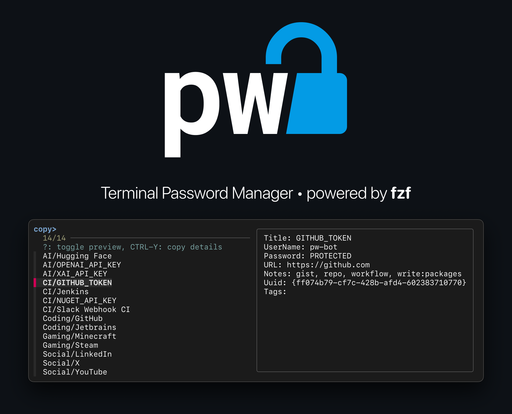
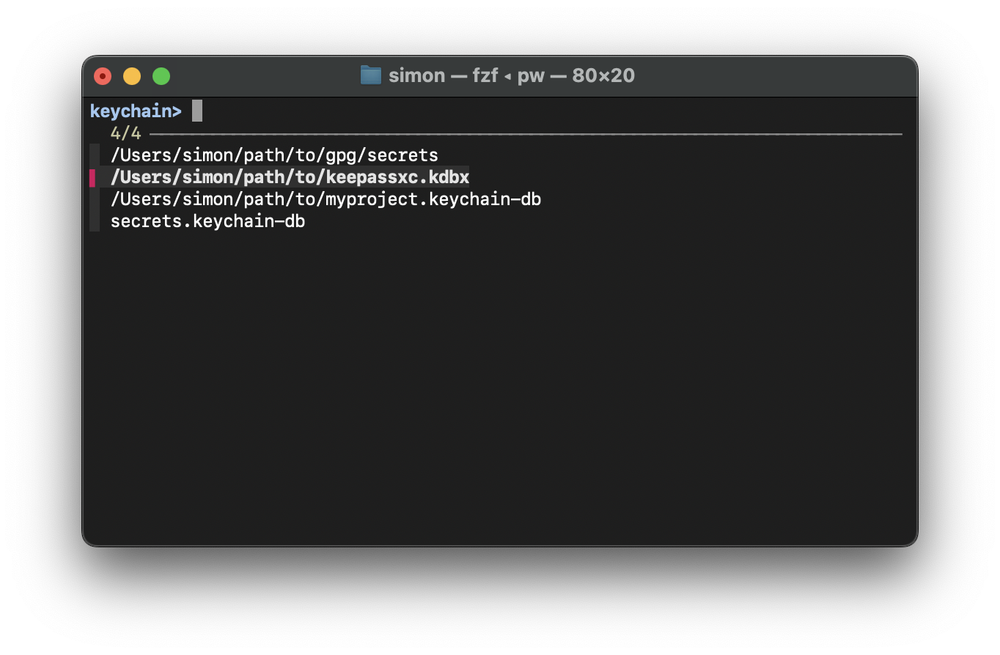

# pw 🔐 - Terminal Password Manager • powered by **fzf**



`pw` is a command-line password manager unifying trusted password managers
like [macOS Keychain](https://developer.apple.com/documentation/security/keychain_services),
[KeePassXC](https://keepassxc.org) and [GnuPG](https://www.gnupg.org) in a single terminal interface.
It combines the security of your favourite password managers with the speed and
simplicity of the [fzf](https://github.com/junegunn/fzf) fuzzy finder and allows
you to interact with [multiple keychains](#multiple-keychains) effortlessly.


[](https://github.com/sschmid/pw-terminal-password-manager/actions/workflows/ci.yml)
[](https://coveralls.io/github/sschmid/pw-terminal-password-manager)
[](https://github.com/sschmid/pw-terminal-password-manager/releases)
[](https://twitter.com/intent/follow?original_referer=https%3A%2F%2Fgithub.com%2Fsschmid%2Fpw&screen_name=s_schmid&tw_p=followbutton)

---

## Why `pw`?

- **Built on Proven Tools:** Combines reliable and established password managers into one interface.
- **Efficiency:** Rapid interaction via [fzf](https://github.com/junegunn/fzf).
- **Simplicity:** Pure bash — easy to understand, modify, and extend.
- **Extensibility:** Add plugins for your preferred password managers in minutes (see [plugins](plugins)).
- **Clipboard Management:** Auto-clears passwords after a configurable time.

---

## Install

See [requirements](#requirements) for dependencies.

### Install script (recommended)

```bash
curl -fsSL https://raw.githubusercontent.com/sschmid/pw/main/install | bash
```

### Download

[Latest release](https://github.com/sschmid/pw-terminal-password-manager/releases/latest)
extract and add `src` to your `$PATH`, or run directly:

```bash
~/Downloads/pw/src/pw
```

### Update / Migrate / Uninstall

```bash
pw update
pw migrate
~/.local/share/pw/install --uninstall
```

---

## Tested on the following platforms:

|                                                        | Platform                           | Containerfile                                                |
|:------------------------------------------------------:|------------------------------------|:------------------------------------------------------------:|
|  | macOS                              |                                                              |
|  | Alpine Linux                       | [Containerfile](container/alpine/Containerfile)              |
|  | Arch Linux                         | [Containerfile](container/archlinux/Containerfile)           |
|  | Debian                             | [Containerfile](container/debian/Containerfile)              |
|  | Fedora                             | [Containerfile](container/fedora/Containerfile)              |
|  | openSUSE Tumbleweed                | [Containerfile](container/opensuse-tumbleweed/Containerfile) |
|  | Ubuntu                             | [Containerfile](container/ubuntu/Containerfile)              |

---

## Quickstart

```bash
pw init ~/secrets.keychain-db         # macOS Keychain
# pw init ~/secrets.kdbx              # KeePassXC
# pw init ~/secrets/                  # GnuPG (trailing `/`)

# pw auto-discovers keychains in the current folder.
# Add to ~/.config/pw/pw.conf to access them from anywhere:
echo 'keychain = ~/secrets.keychain-db' >> ~/.config/pw/pw.conf

pw add GitHub                         # add entry with name
pw add                                # add entry interactively
pw GitHub                             # copy password
pw -p                                 # fzf select, print instead of copy
```

For GnuPG, make sure you have a valid GPG key (not expired, with encryption capability `[E]`).

```bash
# List keys
gpg --list-secret-keys --keyid-format long

# If you don't have one yet, create it with
gpg --full-generate-key
```

```bash
pw init ~/secrets/                   # trailing `/` for GnuPG
pw -k ~/secrets add GitHub           # specify keychain for the first item
pw add GitHub.gpg                    # binary format (default)
pw add GitHub.asc                    # ASCII-armored format
pw GitHub                            # copy password
```

---

## How `pw` works

`pw` forwards commands to plugins that implement these functions:
`init`, `add`, `edit`, `mv`, `get`, `show`, `rm`, `ls`, `open`, `lock`, `unlock` (see [plugins](plugins)).

| Feature                                            | macOS Keychain | KeePassXC                              | GnuPG    |
|----------------------------------------------------|:--------------:|:--------------------------------------:|:--------:|
| Create keychain                                    | ✅             | ✅                                     | ✅ (dir) |
| Add entry (name + password)                        | ✅             | ✅                                     | ✅       |
| Add entry (name, account, url, notes + password)   | ✅             | ✅                                     | 🔐       |
| Multiple entries with same name (different account)| ✅             | ❌                                     | ❌       |
| Add entry in groups (e.g. Coding/Work)             | ❌             | 🔐                                     | ✅       |
| Edit entry                                         | ✅             | ✅                                     | ✅       |
| Move (rename) entry                                | ❌             | 🔐                                     | ✅       |
| Remove entry                                       | ✅             | ✅                                     | ✅       |
| List entries                                       | ✅             | ✅                                     | ✅       |
| Open keychain                                      | ✅             | ✅                                     | ✅       |
| Lock keychain                                      | ✅             | ℹ️ keychain is never left unlocked      | ✅       |
| Unlock keychain                                    | ✅             | ✅ starts interactive session          | ✅       |
| Key file support                                   | ❌             | ✅                                     | ❌       |
| YubiKey support                                    | ❌             | ✅                                     | ❌       |
| Auto keychain discovery                            | ✅             | ✅                                     | ✅       |

<sup>
✅: native support by the password manager<br />
🔐: workaround implemented by pw<br />
❌: not supported by the password manager
</sup>

---

## Security Considerations

The following are notes on the underlying `security` command and `gpg` that `pw` integrates with.
These risks arise from the behavior of these tools, not from `pw` itself.

### macOS `security` Command

When accessing keychain items added by other applications, the user is typically prompted to `allow` or `always allow` access.
However, entries added via the `security` command itself are auto-granted access without future prompts — other apps can exploit this.

`pw` avoids this by not adding the `security` command to the keychain's ACL by default, giving you full control over access per item.
See [macOS Keychain](#macos-keychain) to change the default ACL behaviour.

> [!TIP]
> - Set the keychain to require a password after a certain time and lock on sleep.
> - Lock after use: `pw lock`

Metadata (name, account, URL, comments) can be listed even when locked — a macOS Keychain limitation.
Workarounds include encrypting the keychain and only temporarily decrypting it.

### GPG Passphrase Caching

GPG caches passphrases after use, allowing access to the private key without re-entering it.

> [!TIP]
> - Shorten the cache time via `gpg-agent` settings
> - Clear the passphrase cache: `pw lock`

While GPG encrypts file contents, file names can still be listed without a passphrase — a GPG limitation.
Workarounds include using a separate encrypted container or `tar` to encrypt files into a single archive.

### KeePassXC

KeePassXC, unlike the `security` command and GPG, remains locked when not in use and does not have these risks.

---

## Usage

In examples below, `[<args>]` = `name`, `account`, `url`, `notes` (in order).

**fzf tips:** Press `?` to toggle entry preview (name, account, url, notes). Press `CTRL-Y` to copy/print details.

### Create keychain

```bash
pw init secrets.keychain-db     # macOS Keychain (defaults to ~/Library/Keychains)
pw init ~/secrets.keychain-db   # macOS Keychain (absolute path)
pw init ~/secrets.kdbx          # KeePassXC
pw init ~/secrets/              # GnuPG (trailing `/`)
```

### Commands

```
pw add [<args>]                 add entry (interactive if no args)
pw edit [<args>]                edit entry (fzf if no args)
pw mv [<args>]                  move/rename entry (fzf if no args)
pw [-p] [<args>]                copy/print password (fzf if no args)
pw [-p] show [<args>]           copy/print details (fzf if no args)
pw rm [<args>]                  remove entry (fzf if no args)
pw [-p] gen [<len>] [<class>]   generate password (default: 24 [:graph:])
```

Examples:

```bash
pw add GitHub                            # add entry with name
pw add Google work@example.com           # add entry with name + account
pw add Coveralls "" https://coveralls.io "login via GitHub"  # name, url, notes
pw add Coding/GitHub                     # add entry with name in group Coding
pw gen 16                                # generate 16-char password
pw gen 24 '[:alnum:]'                    # generate alphanumeric only
```

### Specify a keychain

```bash
pw -k secrets.keychain-db                # per-command flag
PW_KEYCHAIN=secrets.keychain-db pw       # per-command env var
export PW_KEYCHAIN=secrets.keychain-db   # shell-wide
```

### Multiple keychains

Add keychains to `~/.config/pw/pw.conf`:

```ini
[keychains]
keychain = secrets.keychain-db
keychain = ~/path/to/myproject.keychain-db
keychain = ~/path/to/keepassxc.kdbx
keychain = ~/path/to/gpg/secrets
```

Without `-k` or `PW_KEYCHAIN`, `pw` uses fzf to let you pick one.



### Auto-discovery

`pw` searches the current directory for keychains, so you can keep them alongside your project.

### In scripts

Use `pw` to avoid leaking secrets in scripts that you share or commit.

```bash
curl -s -H "Authorization: token $(pw -p GITHUB_TOKEN)" https://api.github.com/user
```

### Provide passwords via STDIN

> [!CAUTION]
> Avoid plain-text passwords — they can leak in process listings, history, logs, and network traffic.
> Use environment variables instead.

```bash
echo "${MY_PASSWORD}" | pw init ~/secrets.kdbx
pw add GitHub <<< "${MY_PASSWORD}"
```

---

## Customization

Config file: `~/.config/pw/pw.conf` (auto-created with defaults, or use `-c /path/to/config`).
See [examples/pw.conf](examples/pw.conf) for a full reference.

```ini
[general]
password_length = 24
password_character_class = [:graph:]
clipboard_clear_time = 45

# pbcopy/pbpaste, xclip, xsel, and wl-copy/wl-paste are supported by default.
# If you're using a different clipboard manager, you can specify it here:
# copy = my-copy-command
# paste = my-paste-command

[plugins]
plugin = $PW_HOME/plugins/gpg
plugin = $PW_HOME/plugins/keepassxc
plugin = $PW_HOME/plugins/macos_keychain

[keychains]
keychain = secrets.keychain-db
keychain = ~/path/to/your/gpg/vault
keychain = ~/path/to/your/keychain.kdbx
keychain = ~/path/to/your/keychain.keychain-db
```

Environment variables override config file settings:

```bash
export PW_KEYCHAIN=secrets.keychain-db
export PW_GEN_LENGTH=24
export PW_GEN_CLASS='[:graph:]'
export PW_CLIP_TIME=45
```

---

## Plugin-specific configuration

Append `:key=value` to any keychain path (in `-k`, env vars, or config):

```bash
pw -k ~/secrets.kdbx:key1=value1,key2=value2
```

### macOS Keychain

To auto-allow the `security` command in the ACL:

```ini
[macos_keychain]
keychain_access_control = always-allow
```

Or: `export PW_MACOS_KEYCHAIN_ACCESS_CONTROL="always-allow"`

### KeePassXC

- Key file: `~/secrets.kdbx:keyfile=/path/to/keyfile`
- YubiKey: `~/secrets.kdbx:yubikey=1:23456789`

### GnuPG

- Default encryption key: `~/path/to/gpg/secrets:key=634419040D678764`
- Output binary: `pw add GitHub.gpg`
- Output ASCII-armored: `pw add GitHub.asc`

Ignore false-positive keychain dirs:

```ini
[gpg]
ignore_path = ~
ignore_path = ~/ignored_folder
```

Or: `export PW_GPG_IGNORE_PATHS="${HOME};${HOME}/ignored_folder;"`

---

## Requirements

- `bash`
- `fzf`
- `gnupg` (optional, GnuPG plugin)
- `keepassxc` (optional, KeePassXC plugin)

Supported clipboard managers:
- `pbcopy`/`pbpaste` (macOS)
- `xclip`, `xsel` (X11)
- `wl-copy`/`wl-paste` (Wayland)

If you're using a different clipboard manager, you can specify it in `~/.config/pw/pw.conf`:

```ini
[general]
copy = my-copy-command
paste = my-paste-command
```
