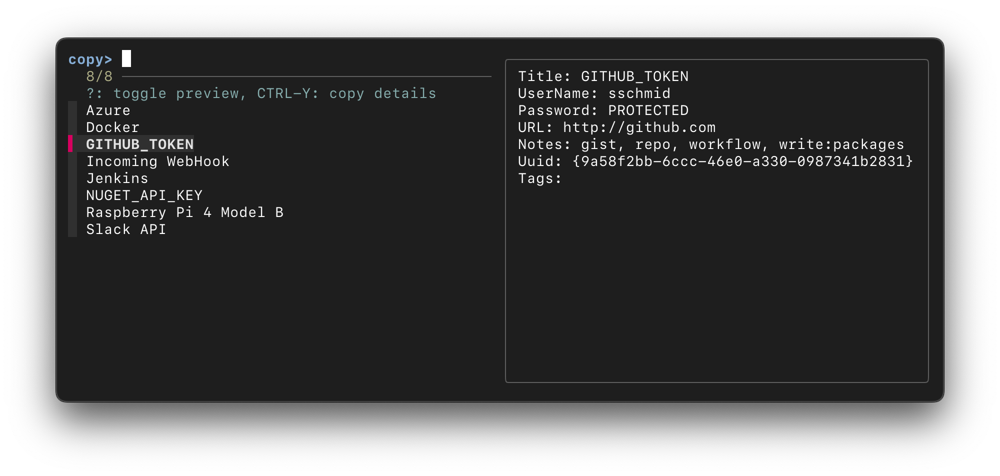
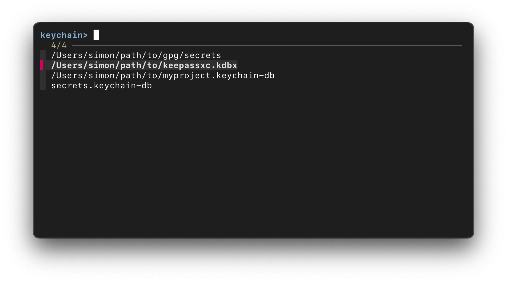

# 🔐 `pw` - Terminal Password Manager powered by `fzf`

`pw` is a command-line password manager unifying trusted password managers
like [macOS Keychain](https://developer.apple.com/documentation/security/keychain_services),
[KeePassXC](https://keepassxc.org) and [GnuPG](https://www.gnupg.org) in a single interface within the terminal.
It combines the security of your favourite password managers with the speed and
simplicity of the [fzf](https://github.com/junegunn/fzf) fuzzy finder and allows
you to interact with [various keychains](#using-multiple-keychains) effortlessly.

[](https://github.com/sschmid/pw-terminal-password-manager/actions/workflows/ci.yml)
[](https://coveralls.io/github/sschmid/pw-terminal-password-manager)
[](https://github.com/sschmid/pw-terminal-password-manager/releases)
[](https://twitter.com/intent/follow?original_referer=https%3A%2F%2Fgithub.com%2Fsschmid%2Fpw&screen_name=s_schmid&tw_p=followbutton)

# Why `pw`?

- **Built on Proven Tools:** Instead of reinventing password management, `pw` combines reliable, established tools into one convenient interface.
- **Efficiency:** With the [fzf](https://github.com/junegunn/fzf) fuzzy finder, `pw` allows for rapid and intuitive interaction with your keychains - nice!
- **Simplicity:** `pw` is built using simple bash, making it easy to understand, modify, and extend.
- **Extensibility:** Adding plugins for your preferred password managers takes only minutes (see [plugins](plugins)).
- **Clipboard Management:** Automatically clears passwords from the clipboard after a configurable time.
- **Multiple Keychain Support**: Effortlessly manage and switch between [multiple keychains](#using-multiple-keychains) stored in various locations.



# Install and update `pw`

See [requirements](#requirements) for dependencies.

### Install script

```bash
sudo bash -c "$(curl -fsSL https://raw.githubusercontent.com/sschmid/pw-terminal-password-manager/main/install)"
```

### Manual install

```bash
git clone https://github.com/sschmid/pw-terminal-password-manager /opt/pw
ln -s /opt/pw/src/pw /usr/local/bin/pw
```

### Update

```bash
sudo pw update
```

### Uninstall

```bash
sudo /opt/pw/install --uninstall
```

### Download latest release

You can download the latest release from the
[releases page](https://github.com/sschmid/pw-terminal-password-manager/releases/latest)
or use the following link to download the latest release directly:
[pw.zip](https://github.com/sschmid/pw-terminal-password-manager/releases/latest/download/pw.zip)

Download the latest release, extract it, and add the `src` folder to your `$PATH`.
Alternatively, you can use `pw` directly from the `src` directory.

```bash
~/Downloads/pw/src/pw
```

|                                                                                             | Tested on the following platforms: |                                                              |
|---------------------------------------------------------------------------------------------|------------------------------------|--------------------------------------------------------------|
|  | macOS                              |                                                              |
|                   | Alpine Linux                       | [Containerfile](container/alpine/Containerfile)              |
|                     | Arch Linux                         | [Containerfile](container/archlinux/Containerfile)           |
|                   | Debian                             | [Containerfile](container/debian/Containerfile)              |
|                   | Fedora                             | [Containerfile](container/fedora/Containerfile)              |
|                 | openSUSE Tumbleweed                | [Containerfile](container/opensuse-tumbleweed/Containerfile) |
|                   | Ubuntu                             | [Containerfile](container/ubuntu/Containerfile)              |

# Quickstart

```bash
# create a keychain (.keychain-db for macOS Keychain, .kdbx for KeePassXC)
pw init ~/secrets.keychain-db

# optionally configure keychains in ~/.config/pw/pw.conf so you can access them
# from anywhere, otherwise, pw will discover keychains in the current directory
echo 'keychain = ~/secrets.keychain-db' >> ~/.config/pw/pw.conf

# add an entry
pw add GitHub sschmid

# add another entry interactively
pw add

# copy the password directly by providing the name
pw GitHub

# or use fzf to select an entry (-p prints the password instead of copying it)
pw -p
```

If you would like to manage your passwords yourself, you can use `pw` with
GnuPG to store encrypted passwords in a directory:

```bash
# create a keychain
pw init ~/secrets/   # end with `/` for GnuPG
cd ~/secrets

# optionally configure keychains in ~/.config/pw/pw.conf so you can access them
# from anywhere, otherwise, pw will discover gpg encrypted passwords in the
# current directory
echo 'keychain = ~/secrets/' >> ~/.config/pw/pw.conf

# add an entry
# if you haven't configured ~/.config/pw/pw.conf yet, you need to specify the
# keychain once because the directory is empty and pw can't determine the
# keychain type yet
pw -k ~/secrets add GitHub sschmid

# add another entry interactively
pw add

# output binary format (default)
pw add GitHub.gpg

# output ASCII-armored format
pw add GitHub.asc

# copy the password directly by providing the name
pw GitHub

# or use fzf to select an entry (-p prints the password instead of copying it)
pw -p
```

# How `pw` works

`pw` provides a unified interface to interact with various keychains and forwards
commands to the respective password manager using plugins. Plugins are simple
bash scripts that implement the following functions (see [plugins](plugins)):

- `init`
- `add`
- `edit`
- `get`
- `show`
- `rm`
- `ls`
- `open`
- `lock`
- `unlock`

Password managers may vary in their capabilities, so `pw` provides a
consistent interface by implementing workarounds where necessary.

Here's an overview of which features are supported by each plugin:

| Feature                                                                         | macOS Keychain | KeePassXC                         | GnuPG          |
|--------------------------------------------------------------------------------:|:--------------:|:---------------------------------:|:--------------:|
| Create keychain                                                                 | ✅             | ✅                                 | ✅ (directory) |
| Add entry with name and password                                                | ✅             | ✅                                 | ✅             |
| Add entry with name, account, url, notes and password                           | ✅             | ✅                                 | 🔐             |
| Allow multiple entries with the same <br /> name given the account is different | ✅             | ❌                                 | ❌             |
| Add entry in groups (e.g. Coding/Work)                                          | ❌             | 🔐                                 | ✅             |
| Edit entry                                                                      | ✅             | ✅                                 | ✅             |
| Remove entry                                                                    | ✅             | ✅                                 | ✅             |
| List entries                                                                    | ✅             | ✅                                 | ✅             |
| Open keychain                                                                   | ✅             | ✅                                 | ✅             |
| Lock keychain                                                                   | ✅             | ℹ️ keychain is never left unlocked | ✅             |
| Unlock keychain                                                                 | ✅             | ✅ starts interactive session      | ✅             |
| Key file support                                                                | ❌             | ✅                                 | ❌             |
| YubiKey support                                                                 | ❌             | ✅                                 | ❌             |
| Automatic keychain discovery                                                    | ✅             | ✅                                 | ✅             |

<sup>
✅: native support by the password manager<br />
🔐: workaround implemented by pw<br />
❌: not supported by the password manager
</sup>

# Security Considerations

> [!IMPORTANT]
> `pw` supports the macOS `security` command and `gpg` through its plugins,
> which may introduce security risks. These risks arise from the behavior of
> these underlying commands, not from `pw` itself.

## macOS `security` Command

Typically, when accessing keychain items added by other applications, the user
is prompted to `allow` or `always allow` access. However, when keychain entries
are added using the `security` command itself, the command is automatically
granted access to those items without future prompts. This can be a security risk,
because other applications can use the `security` command to access these items
without prompting the user.

`pw` changes this behaviour to reduce security risks by not automatically adding
the `security` command to the keychain's access control list. This way you have
full control over which applications can access your keychain items and decide
whether to allow or deny access on a item-by-item basis.

See [Plugin specific configuration](#macos-keychain) to change this behaviour.

If you decide to change this behaviour, consider the following recommendations:

> [!TIP]
> - Change the keychain settings to require a password after a certain time and
>   activate the option to lock the keychain when the computer sleeps.
> - Lock the keychain after each use to secure it.

```bash
pw lock
```

Additionally, keychain entries can be listed without requiring a password, even
when the keychain is locked. This can expose metadata about the keychain entries
like the name, account, URL and comments. This cannot be prevented by `pw` and
is a limitation of the macOS Keychain. There are workarounds like encrypting the
keychain and only temporarily decrypting it when needed.

## GPG Passphrase Caching

GPG caches passphrases after use, which can allow access to the private key
without re-entering the passphrase.

> [!TIP]
> - Shorten the GPG passphrase caching time by adjusting the `gpg-agent` settings.
> - Kill the GPG agent process to clear the passphrase cache.

```bash
pw lock   # will run 'gpgconf --kill gpg-agent' to kill the GPG agent process
```

Additionally, while GPG encrypts files, the file names can still be listed
without requiring the passphrase, thereby exposing the file names. This cannot
be prevented by `pw` and is a limitation of GPG. There are workarounds like
using a separate encrypted container or using a tool like `tar` to encrypt the
files into a single archive.

## KeePassXC

> [!NOTE]
> KeePassXC, unlike the `security` command and GPG, remains locked when not in
> use and does not have these risks.

# Security Comparison

| Security Considerations                    | macOS Keychain | KeePassXC | GnuPG |
|-------------------------------------------:|:--------------:|:---------:|:-----:|
| Keychain stays unlocked                    | ⚠️              | ✅        | ⚠️     |
| Metadata exposure while keychain is locked | ⚠️              | ✅        | ⚠️     |

<sup>
✅: no known security risk<br />
⚠️: potential security risk, but can be mitigated<br />
🚨: potential security risk, no mitigation possible
</sup>

# Usage

In all following examples, `[<args>]` refers to the optional
arguments `name`, `account`, `url`, `notes` in that order.

When using fzf mode to select an entry, such as when getting, editing,
or removing an entry, you can toggle the entry preview by pressing `?`.
The entry preview shows details like the name, account, url, and notes and
is off by default.

Press `CTRL-Y` on any entry to copy (or print) the details.

## Config file

The suggested location for the `pw` configuration file is `$XDG_CONFIG_HOME/pw/pw.conf`,
which usually resolves to `~/.config/pw/pw.conf`. `pw` will automatically create
this file with default values if it doesn't exist.

You can specify a different configuration file using the `-c` option:

```bash
pw -c /path/to/config
```

## Create keychain

```
pw init <keychain>                 create keychain
```

Examples:

```bash
pw init ~/secrets.keychain-db   # macOS Keychain
pw init ~/secrets.kdbx          # KeePassXC
pw init ~/secrets/              # GnuPG (end with `/` to create a directory)

# macos_keychain special behaviour
pw init secrets.keychain-db            # will create a keychain in ~/Library/Keychains
pw init "${PWD}/secrets.keychain-db"   # will create a keychain in the current directory
```

## Add entry with name and optional account

```
pw add [<args>]                    add entry. If no args, interactive mode
```

Examples:

```bash
pw add                                      # add interactively
pw add GitHub                               # add entry with name
pw add Google work@example.com              # add entry with name and account
pw add Google personal@example.com
pw add Homepage admin https://example.com   # add entry with name, account, url
pw add Coveralls "" https://coveralls.io "login via GitHub" # add entry with name, url, notes
```

If a plugin doesn't support multiple entries with the same name,
you can add the account to the name:

```bash
pw add "Google (Work)" work@example.com
pw add "Google (Personal)" personal@example.com
```

## Add entry in group

Examples:

```bash
pw add Coding/GitHub
pw add Coding/JetBrains
```

## Edit entry

```
pw edit [<args>]                   edit entry. If no args, fzf mode
```

Examples:

```bash
pw edit          # starts fzf to select an entry
pw edit GitHub
```

## Get entry

```
pw [-p] [<args>]                   copy (or print) password. If no args, fzf mode
```

Examples:

```bash
pw          # starts fzf to select an entry
pw GitHub
```

## Show entry

```
pw [-p] show [<args>]              copy (or print) details. If no args, fzf mode
```

Examples:

```bash
pw show          # starts fzf to select an entry
pw show GitHub
```

## Remove entry

```
pw rm [<args>]                remove entry. If no args, fzf mode
```

Examples:

```bash
pw rm          # starts fzf to select an entry
pw rm GitHub
```

## Generate a password

```
pw [-p] gen [<length>] [<class>]   generate password with given length and
                                   character class (default: 35 [:graph:])
```

Examples:

```bash
pw gen                  # equivalent to pw gen 35 '[:graph:]'
pw gen 16
pw gen 24 '[:alnum:]'
pw gen 32 '[:digit:]'
```

## Automatic keychain discovery

`pw` automatically searches for keychains in the current directory. This way
you can keep your keychains in the same directory as your project and `pw` will
automatically discover and use them.

## Specifying a keychain

There are multiple ways to specify a keychain:

```bash
# specify keychain using -k for the current command (overrides PW_KEYCHAIN)
pw -k secrets.keychain-db
```

```bash
# specify keychain for the current command
PW_KEYCHAIN=secrets.keychain-db pw
```

```bash
# export default keychain for the current shell
export PW_KEYCHAIN=secrets.keychain-db
pw
```

## Using multiple keychains

`pw` allows you to interact with multiple keychains from different password
managers. This feature is particularly useful when you have keychains stored
in various locations. You can specify different keychains using the
configuration file, which defaults to `~/.config/pw/pw.conf`.

To use multiple keychains, add your desired keychains to `~/.config/pw/pw.conf`, e.g.:

```ini
[keychains]
keychain = secrets.keychain-db
keychain = ~/path/to/myproject.keychain-db
keychain = ~/path/to/keepassxc.kdbx
keychain = ~/path/to/gpg/secrets
```

After configuring your keychains, continue using `pw` as usual. If no keychain
is specified with `-k` or by setting `PW_KEYCHAIN`, `pw` allows you to select
one from your `~/.config/pw/pw.conf` file using the fuzzy finder.



## Using `pw` in a command or script
Use `pw` to avoid leaking secrets in scripts that you share or commit.

```bash
curl -s -H "Authorization: token $(pw -p GITHUB_TOKEN)" https://api.github.com/user
```

## Provide passwords via `STDIN`

To avoid password prompts that can interrupt scripts,
you can provide passwords via `STDIN`.

> [!CAUTION]
> Avoid providing passwords in plain text, because they can be exposed in process
  listings, shell history, logs, and through insecure network transmissions, making
  them vulnerable to theft or misuse. Instead, use secure methods like environment
  variables to protect sensitive information.

```bash
echo "${MY_PASSWORD}" | pw init ~/secrets.kdbx
echo "${MY_PASSWORD}" | pw add Google personal@example.com
echo "${MY_PASSWORD}" | pw unlock
```

If your shell supports `STDIN` with here string (like `bash`), you can use it like this:

```bash
pw init ~/secrets.kdbx <<< "${MY_PASSWORD}"
pw add Google personal@example.com <<< "${MY_PASSWORD}"
pw unlock <<< "${MY_PASSWORD}"
```

# Customization

Configure `pw` in `~/.config/pw/pw.conf` with the following options:

```ini
[general]
password_length = 35
password_character_class = [:graph:]
clipboard_clear_time = 45

# pbcopy/pbpaste, xclip, xsel, and wl-copy/wl-paste are supported by default.
# If you're using a different clipboard manager, you can specify it here:
# copy = my-copy-command
# paste = my-paste-command

[plugins]
plugin = $PW_HOME/plugins/gpg
plugin = $PW_HOME/plugins/keepassxc
plugin = $PW_HOME/plugins/macos_keychain

[keychains]
keychain = secrets.keychain-db
keychain = ~/path/to/your/gpg/vault
keychain = ~/path/to/your/keychain.kdbx
keychain = ~/path/to/your/keychain.keychain-db
```

Additionally, you can use environment variables to customize `pw`. They will
override the settings in `~/.config/pw/pw.conf`.

```bash
# Default keychain used when not specified with -k
# otherwise, ~/.config/pw/pw.conf is used to select a keychain with fzf
export PW_KEYCHAIN=secrets.keychain-db

# Default length of generated passwords
export PW_GEN_LENGTH=35

# Default character class for generated passwords
export PW_GEN_CLASS='[:graph:]'

# Time after which the password is cleared from the clipboard
export PW_CLIP_TIME=45
```

# Plugin specific configuration

Some plugins support additional configuration options by appending them to the
keychain path after a colon `:`, e.g. `/path/to/keychain:key=value`.

This syntax can be used everywhere a keychain is specified, e.g.:

```bash
pw -k ~/secrets.kdbx:key1=value1,key2=value2
```

In your `~/.config/pw/pw.conf`:
```bash
...
keychain = ~/secrets.kdbx:key1=value1,key2=value2
...
```

## macOS Keychain

As mentioned in the [Security Considerations](#security-considerations) section,
`pw` won't automatically add the `security` command to the keychain's access
control list to reduce security risks. If you want to add the `security` command
to the keychain's access control list by default, you can add this to your
`~/.config/pw/pw.conf` file below the `[plugin]` section:

```ini
[plugins]
plugin = $PW_HOME/plugins/gpg
plugin = $PW_HOME/plugins/keepassxc
plugin = $PW_HOME/plugins/macos_keychain

[macos_keychain]
keychain_access_control = always-allow
```

or set the environment variable `PW_MACOS_KEYCHAIN_ACCESS_CONTROL` to `always-allow`:

```bash
export PW_MACOS_KEYCHAIN_ACCESS_CONTROL="always-allow"
```

## KeePassXC

If you want to use a key file for unlocking the database,
you can specify the path to the key file:

```bash
~/secrets.kdbx:keyfile=/path/to/keyfile
```

If you're using a YubiKey with KeePassXC, you can specify the slot to use:

```bash
~/secrets.kdbx:yubikey=1:23456789
```

## GnuPG

To set a different gpg key as the default for encryption, you can specify the key id:

```bash
~/path/to/gpg/secrets:key=634419040D678764
```

You can control the gpg output format by specifying a file extension:

```bash
# output binary format (default)
pw add GitHub.gpg

# output ASCII-armored format
pw add GitHub.asc
```

There may be false positives when discovering keychains. To ignore specific folders,
add the following to your `~/.config/pw/pw.conf` file below the `[plugin]` section:

```ini
[plugins]
plugin = $PW_HOME/plugins/gpg
plugin = $PW_HOME/plugins/keepassxc
plugin = $PW_HOME/plugins/macos_keychain

[gpg]
ignore_path = ~
ignore_path = ~/ignored_folder
```

or set the environment variable `PW_GPG_IGNORE_PATHS`:

```bash
export PW_GPG_IGNORE_PATHS="${HOME};${HOME}/ignored_folder;"
```

# Requirements

Install the following [DEPENDENCIES.md](DEPENDENCIES.md) to use `pw`:

- `bash`
- `fzf`
- `gnupg` (optional, for GnuPG plugin)
- `keepassxc` (optional, for KeePassXC plugin)

Make sure to have a clipboard manager installed to copy passwords to the clipboard.
Currently supported clipboard managers are:
- `pbcopy`, `pbpaste` (macOS, built-in)
- `xclip` (Linux)
- `xsel` (Linux)
- `wl-clipboard` (Wayland)

If you're using a different clipboard manager,
you can specify it in your `~/.config/pw/pw.conf` file.

```ini
[general]
copy = my-copy-command
paste = my-paste-command
```

### macOS

```bash
brew install $(cat /opt/pw/DEPENDENCIES.md)
```

### Alpine Linux

```bash
apk add $(cat /opt/pw/DEPENDENCIES.md)
```

### Arch Linux

```bash
pacman -Syu && pacman -S --needed $(cat /opt/pw/DEPENDENCIES.md)
```

### Debian/Ubuntu

```bash
apt-get update && apt-get install $(cat /opt/pw/DEPENDENCIES.md)
```

### Fedora

```bash
dnf install $(cat /opt/pw/DEPENDENCIES.md)
```

### openSUSE Tumbleweed

```bash
zypper install --no-recommends $(cat /opt/pw/DEPENDENCIES.md)
```
